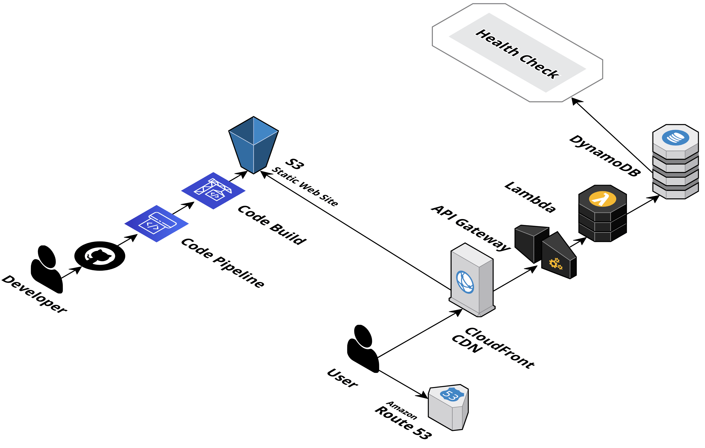
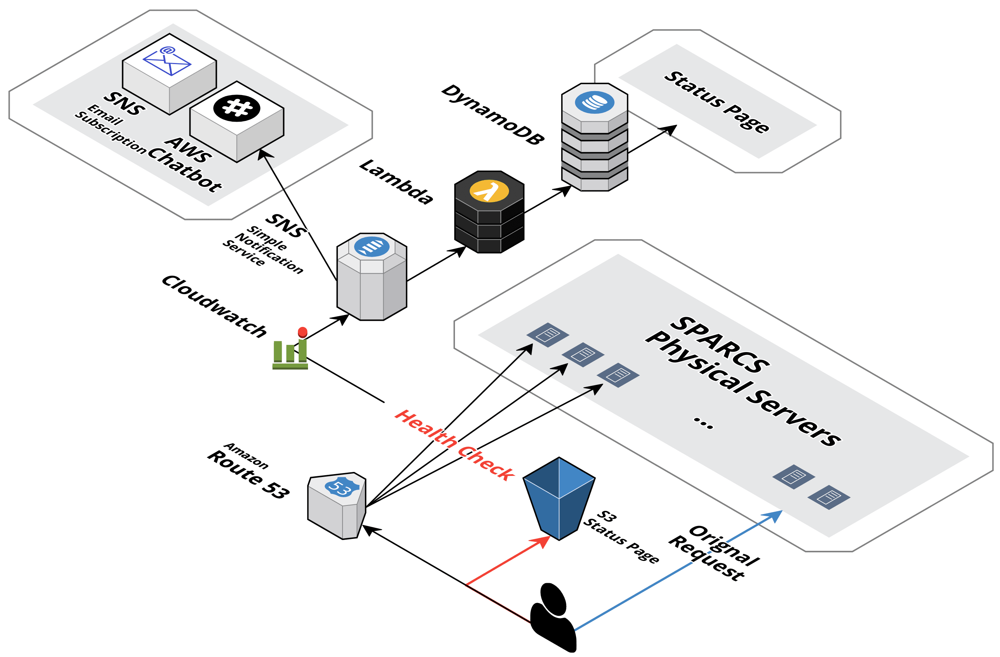

# Status Page

## Status Page

###Frontend
git repo -> S3 [status.sparcs.org](https://s3.console.aws.amazon.com/s3/buckets/status.sparcs.org/?region=ap-northeast-2&tab=overview) -> [cloudfront](https://console.aws.amazon.com/cloudfront/home?region=ap-northeast-2#distribution-settings:E2S5ARYH80LXX5) -> Route 53

#### CI/CD
[Master branch](https://github.com/sparcs-kaist/status-page) -> [AWS CodePipeline](https://ap-northeast-2.console.aws.amazon.com/codesuite/codepipeline/pipelines/sparcs-status-page/view?region=ap-northeast-2)

### Backend

#### Get Status
[apiGateway](https://ap-northeast-2.console.aws.amazon.com/apigateway/home?region=ap-northeast-2#/apis/g9wa9mxyna/stages/production) -> [lambda service_status](https://ap-northeast-2.console.aws.amazon.com/lambda/home?region=ap-northeast-2#/functions) -> [dynamoDB serviceStatus](https://ap-northeast-2.console.aws.amazon.com/dynamodb/home?region=ap-northeast-2#tables:selected=serviceStatus;tab=overview)

## Health Check

#### Update Status
[route53 healthCheck](https://console.aws.amazon.com/route53/healthchecks/home?region=us-east-1#/) -> [cloudWatch alarms](https://console.aws.amazon.com/cloudwatch/home?region=us-east-1#alarmsV2:?alarmFilter=ALL) -> [SNS](https://console.aws.amazon.com/sns/v3/home?region=us-east-1#/topic/arn:aws:sns:us-east-1:666583083672:serviceStatusTopic) -> [lambda putServiceStatusFromSNS](https://ap-northeast-2.console.aws.amazon.com/lambda/home?region=ap-northeast-2#/functions) -> [dynamoDB serviceStatus](https://ap-northeast-2.console.aws.amazon.com/dynamodb/home?region=ap-northeast-2#tables:selected=serviceStatus;tab=overview)
